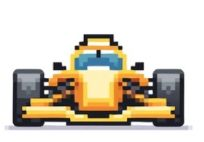
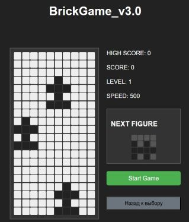
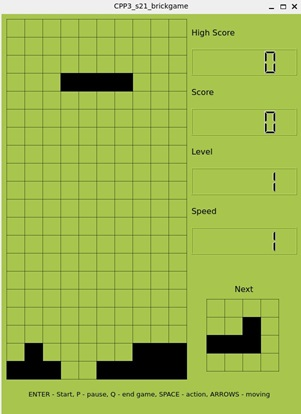
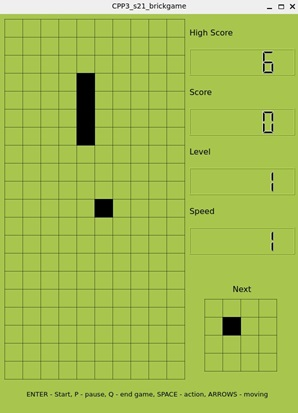

  

# BrickGame_C_Cpp_Go
Educational project - implementation of three classic games on C, C++ and Golang

  

  

  

# 🏎️ BrickGame: Race (Go)

BrickGame: Race is a modern implementation of the classic **arcade racing game** (inspired by *Speed Race* by Taito, 1974) as part of the **BrickGame v3.0** project.  
The project is written in **Go** and supports multiple interfaces: **CLI, Desktop (Qt), and Web GUI**. It also provides a **REST API** for remote interaction with all BrickGame titles.

---

## 📖 Table of Contents
- [Introduction](#-introduction)  
- [Features](#-features)  
- [Project Structure](#-project-structure)  
- [Game Rules](#-game-rules)  
- [API](#-api)  
- [Build & Run](#-build--run)  

---

## 🚀 Introduction
The project extends the **BrickGame collection** by adding a new game: **Race**.  
It includes:
- **Game logic library** implemented as a **finite state machine (FSM)** in Go.  
- **REST API server** to interact with games via HTTP.  
- **Web GUI** (HTML/JS/CSS) that consumes the API.  
- **CLI and Desktop Qt interfaces** upgraded to support the new Race game.  
- Support for **legacy games** (*Snake* and *Tetris*).  

This design ensures modularity, portability, and consistent cross-interface gameplay.

---

## ✨ Features
- 🏎️ Player’s car moves between **3 lanes**.  
- 🚘 Enemy cars appear at the top and move downward.  
- 💥 Collision with an enemy car ends the game.  
- ⏩ Holding the **Up Arrow** increases speed (and difficulty).  
- 🎯 **Score system**: +1 point for every avoided collision.  
- 🏆 **High score persistence** across sessions (`race_high_score.txt`).  
- 📈 **Levels**: every 5 points increases speed up to level 10.  
- 🌐 **REST API** for remote game control.  
- 🖥️ **Multiple interfaces**: Console, Desktop Qt, Web GUI.  

---

## 📂 Project Structure

.
├── Doxyfile
├── Makefile
├── brick_game
│   ├── race
│   │   ├── s21_backend_race.go
│   │   ├── s21_backend_race.h
│   │   └── s21_backend_race_test.go
│   ├── s21_brick_game_cli.c
│   ├── server
│   │   ├── cmd
│   │   │   ├── main_race.go
│   │   │   ├── main_snake.go
│   │   │   └── main_tetris.go
│   │   ├── game_factory.go
│   │   ├── game_interface.go
│   │   ├── handlers.go
│   │   ├── models.go
│   │   ├── race
│   │   │   └── race.go
│   │   ├── snake
│   │   │   └── snake.go
│   │   └── tetris
│   │       └── tetris.go
│   ├── snake
│   │   ├── s21_backend_snake.cpp
│   │   ├── s21_backend_snake.h
│   │   └── s21_snake_wrap.h
│   └── tetris
│       ├── s21_backend_tetris.c
│       └── s21_backend_tetris.h
├── dvi_readme.md
├── fsm_scheme.jpg
├── fsm_scheme_race.jpg
├── fsm_scheme_snake.jpg
├── go.mod
├── go.sum
├── gui
│   ├── cli
│   │   ├── s21_frontend.c
│   │   └── s21_frontend.h
│   ├── desktop
│   │   ├── Makefile
│   │   ├── main.cpp
│   │   ├── mainwindow.cpp
│   │   ├── mainwindow.h
│   │   ├── mainwindow.ui
│   │   ├── s21_brickgame_desktop.pro
│   │   ├── s21_brickgame_desktop.pro.user
│   │   ├── s21_field_window.cpp
│   │   ├── s21_field_window.h
│   │   ├── s21_next_field_window.cpp
│   │   └── s21_next_field_window.h
│   └── web_gui
│       ├── game.js
│       ├── index.html
│       ├── readme.md
│       ├── src
│       │   ├── config.js
│       │   ├── game-board.js
│       │   ├── tile.js
│       │   └── utils.js
│       └── styles.css
├── main_menu.cpp
├── tests
│   ├── s21_snake_test.cpp
│   ├── s21_snake_test.h
│   ├── s21_tetris_test.c
│   ├── s21_tetris_test.h
│   ├── test_s21_snake_backend.cpp
│   └── test_s21_tetris_backend.c
└── valgrind.supp


---

## 🎮 Game Rules
1. The game field is **10×20 pixels**.  
2. Player car starts in the center lane.  
3. Enemy cars randomly spawn in lanes and move downward.  
4. Controls:
   - `←` Move left  
   - `→` Move right  
   - `↑` Increase speed  
5. Game over on collision.  
6. Score = number of overtaken cars.  
7. High score is stored persistently.  

---

## 🌐 API
The **REST API** allows interaction with the game state and actions.  
Specification: `materials/rest-api-specification.yaml`.

Examples:
- `GET /api/games` → List available games  
- `POST /api/race/start` → Start a Race session  
- `PATCH /api/race/move?dir=left` → Move player car left  
- `GET /api/race/state` → Get current game state  

---

## ⚙️ Build & Run

### Requirements
- Go 1.21+  
- GCC / G++ / Make  
- Qt 5+ (for desktop interface)  

### Build
```bash
make           # Build project
make run       # Run default server
```